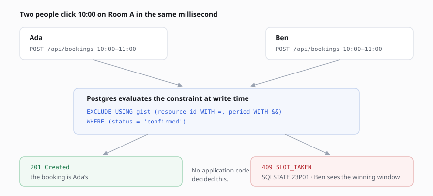
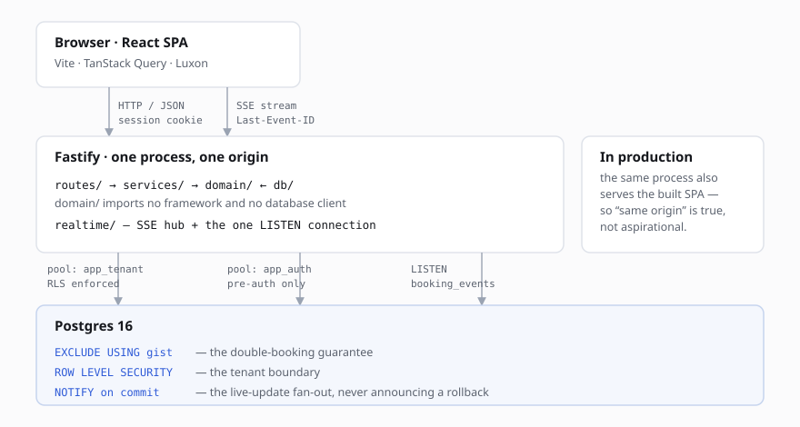

# Slotline

**Booking and resource management for meeting rooms, equipment and consultant time — where double-booking is prevented by the database, not by application code.**

Multi-tenant, live-updating, and correct under concurrency by construction rather than by care.



---

## The idea

Two people click the same slot in the same millisecond. One gets the booking; the other gets a clear refusal. Not because the code is careful — because the second write is impossible.

```sql
ALTER TABLE bookings ADD CONSTRAINT bookings_no_overlap
  EXCLUDE USING gist (resource_id WITH =, period WITH &&)
  WHERE (status = 'confirmed');
```

A `SELECT … WHERE overlaps` followed by an `INSERT` is a race however carefully it is written: both requests read "free", both insert. Postgres evaluates this at write time, so the loser fails with SQLSTATE `23P01` no matter how close together the two arrive — and the partial `WHERE` is what makes cancelling a booking free the slot again, for free.

There is an integration test that fires both requests concurrently and asserts exactly one wins. It is the first test in the suite for a reason.

## What it does

|                  |                                                                                                                                                |
| ---------------- | ---------------------------------------------------------------------------------------------------------------------------------------------- |
| **Resources**    | Rooms, equipment and consultants. Each physical unit is its own resource — three projectors are three rows, no pooling and no allocation step. |
| **Booking**      | Drag on a week grid, pick a length in the dialog, drag a block to move or resize it. Cancel and the slot reopens immediately.                  |
| **Availability** | Weekly opening hours plus dated overrides for holidays, maintenance and one-off openings.                                                      |
| **Live**         | Every open calendar updates as other people book, typically within ~20 ms.                                                                     |
| **Teams**        | Multi-tenant with three roles. Organisations cannot see each other's anything.                                                                 |

### Availability the calendar and the server agree on

Opening hours are **wall-clock in the resource's own zone** — "Mondays 09:00–17:00" means what the clock on the wall reads, on every Monday, including the two a year where the clocks move. The grid greys out closed hours by calling _the same function the server refuses with_, so a greyed slot is exactly a slot that would be rejected. Two implementations of that rule would drift, and the user would meet the difference as a rejection on a slot that looked open.

Narrowing a resource's hours **reports the bookings that no longer fit and keeps them**. Cancelling someone's meeting as a side effect of an admin editing opening hours would be a surprise; an unenforceable rule is at least visible.

### Live, and honest about when it isn't

Server-Sent Events, fanned out by Postgres `LISTEN`/`NOTIFY`. The notification is emitted **inside the same transaction as the booking**, so a client can never be told about a booking that then rolled back. A tab that was closed, asleep, or disconnected across a deploy catches up via `Last-Event-ID`, and is told to resync if it fell further behind than the log can replay.

The header reads **Live** or **Reconnecting**. Silent staleness is the failure mode SSE invites, and a grid that looks current while being wrong is worse than one that admits it.

### Teams

Members book and manage only their own bookings; admins manage resources, hours and anyone's bookings; owners additionally change roles. An admin can create members but **not** other admins — an admin who could mint another admin escalates sideways without limit, which is the same hole as editing your own role.

There is no email provider in the stack, so a new account gets a **one-time temporary password**, shown once and never recoverable, and can do nothing at all until it sets its own.

## Two ideas worth stealing

**Tenant isolation is row-level security, reachable through exactly one function.** The tenant connection pool is not exported; the only way to open a scoped transaction is [`withTenant()`](apps/api/src/db/with-tenant.ts), which sets `app.tenant_id` for the transaction. The failure mode of a forgotten scope becomes _zero rows_, never _another tenant's rows_.

**Pre-authentication lookups get their own database role.** A login has to find the tenant before it can scope to it, so that one path needs to read unscoped. Rather than granting `BYPASSRLS` — which needs superuser, and managed Postgres will not give it to you — `app_auth` _owns_ `tenants`, `users` and `sessions` and bypasses by ownership. It holds **no privilege at all** on bookings or resources, so a future bug reaching for the wrong pool gets a permission error instead of quietly crossing a tenant boundary.

## How it's built — briefly



- **Server**: Fastify 4 on TypeScript, layered `routes/ → services/ → domain/ ← db/`. `domain/` imports no framework and no database client — booking rules are testable with nothing running.
- **Data**: Postgres 16 via Kysely. Chosen over an ORM because the two features carrying this product — a GiST exclusion constraint and RLS policies — are DDL that ORMs treat as escape hatches.
- **Realtime**: one dedicated `LISTEN` connection with backoff reconnect, an SSE hub that skips the database entirely for tenants with nobody watching, and a per-subscriber watermark so a just-reconnected client is never sent a duplicate.
- **Shared**: the availability window arithmetic lives in `packages/shared` and both sides call it — the one deliberate exception to keeping rules in `domain/`.
- **Client**: React + Vite, no CSS framework. Logical properties throughout (`margin-inline-start`, never `margin-left`), so adding Hebrew or Arabic later is a `dir` flip, not a sweep through every rule.
- **Tested**: 125 tests. Domain rules run everywhere; the integration tests need a real Postgres and are reported as **skipped**, never as passed, when one is absent — a fake exclusion constraint would only assert that the fake works.

## Requirements

Node.js 20.11+ and Postgres 16, with `btree_gist`, `citext`, and `LISTEN`/`NOTIFY` on a direct connection — which rules out some managed hosts (see [SPEC §3](docs/SPEC.md)).

## Running

```bash
npm install
cp .env.example .env

# Roles are cluster-level, so they are provisioned outside the migration sequence.
APP_TENANT_ROLE_PASSWORD=... APP_AUTH_ROLE_PASSWORD=... npm run provision
npm run migrate

npm run dev:api    # http://localhost:3000
npm run dev:web    # http://localhost:5173
```

| Command                                       |                                                                             |
| --------------------------------------------- | --------------------------------------------------------------------------- |
| `npm run dev:api` / `dev:web`                 | Development. The Vite proxy keeps it same-origin, exactly as production is. |
| `npm test`                                    | 125 tests — domain rules, and integration against a real Postgres           |
| `npm run typecheck` · `lint` · `format:check` | The gates CI runs                                                           |
| `npm run migrate`                             | Forward-only migrations                                                     |
| `npm run prune`                               | Retention pass by hand, for a platform cron                                 |

Deploying, retention, incident playbooks and a **rehearsed** backup restore — [docs/RUNBOOK.md](docs/RUNBOOK.md).
The full design, every interface and the decisions behind them — [docs/SPEC.md](docs/SPEC.md).

## Layout

```
apps/api          Fastify API.  routes/ → services/ → domain/ ← db/
apps/web          Vite + React SPA
packages/shared   Zod schemas, types, and the availability arithmetic both sides use
docs/SPEC.md      The design document
docs/RUNBOOK.md   Operations
```

> Deliberately not in the repo: `.env` (real connection strings) and `apps/web/dist` (built output). `.env.example` is committed with empty values.

---

<div align="center">

Built by <a href="https://github.com/DahanItamar">Itamar Dahan</a> · © 2026

</div>
